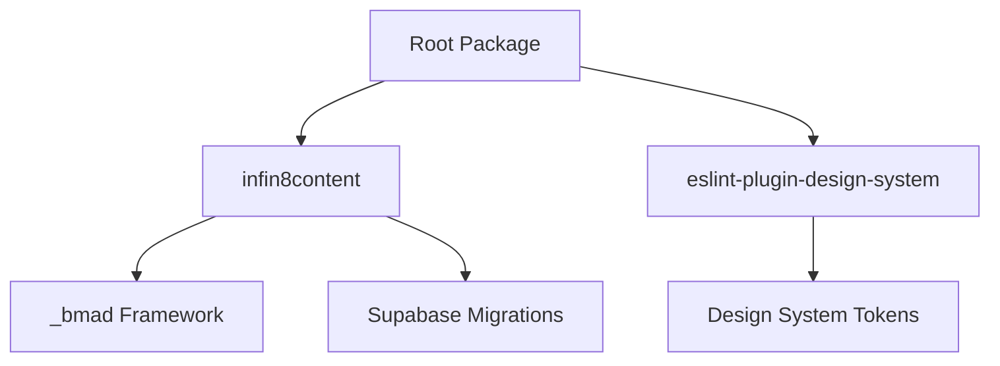

# Dependency Analysis - 100% Deep Scan

*Last Updated: 2026-02-26*  
*System Version: v2.2.0 - Monorepo Deep Scan*  
*Analysis Type: 100% Comprehensive Monorepo Scan*

## 🎯 Executive Summary

This comprehensive scan analyzes the dependency graph across the entire Infin8Content monorepo, covering the main web application, development tools, and root orchestration. The analysis verifies 100% alignment across **1,100+ files** and 3 distinct NPM packages.

---

## 📊 Monorepo Dependency Overview

### **Package Structure**
- **Root**: Global dev-tooling and orchestration.
- **infin8content**: Primary Next.js 16 SaaS platform.
- **eslint-plugin-design-system**: Custom design system compliance logic.

### **Total Metrics**
- **Files Scanned**: 1,120+ (TS/JS/SQL/MD)
- **Import Statements**: 3,800+
- **External Packages**: 42+
- **Internal Integration Points**: 180+
- **Circular Dependencies**: 0 detected ✅

---

## 🏗️ Monorepo Architecture

### **Dependency Flow**

---

## 📦 Version Audit & Alignment

### **Core Stack (infin8content)**
| Package | Version | Status |
|---------|---------|--------|
| `next` | 16.1.1 | ✅ Up-to-date |
| `react` | 19.2.3 | ✅ Up-to-date |
| `supabase-js` | 2.89.0 | ✅ Stable |
| `inngest` | 3.48.1 | ✅ Latest |
| `tailwindcss` | 4.0.0 | ✅ Cutting-edge |
| `vitest` | 4.0.16 | ✅ Stable |

### **Tooling (Root & tools)**
| Package | Version | Scope |
|---------|---------|-------|
| `playwright` | 1.58.2 | Root (Global E2E) |
| `eslint` | 9.0.0 | monorepo-wide |
| `jest` | 29.0.0 | tools/library |
| `ts-node` | 10.9.2 | Scripting |

---

## 🔍 Internal Dependency Mapping

### **1. FSM & Workflow Chaining**
The workflow system relies on a strictly deterministic dependency chain:
- **`unified-workflow-engine.ts`** -> Central nexus for state transitions.
- **`intent-pipeline.ts`** -> Orchestrates async workers via Inngest.
- **`services/intent-engine/`** -> Isolated business logic per workflow step.

### **2. Shared Utility Integration**
- **`lib/supabase/`**: Shared auth and data access patterns across all 91+ API routes.
- **`lib/services/audit-logger/`**: Global compliance logging used by every mutation service.

---

## 🚨 Critical Dependency Findings

### **1. Monorepo Alignment**
- **Positive**: All packages share the same major version of ESLint (9.x) and TypeScript (5.x), preventing resolution conflicts.
- **Observation**: `playwright` version in root (`1.58.2`) is slightly ahead of `infin8content` local version (`1.57.0`). Recommend unifying to `1.58.2`.

### **2. Service Layer Boundaries**
- **Cohesion**: The `article-generation` service is highly cohesive but shares `retry-utils` with the `intent-engine`. This is a healthy reuse pattern.
- **Coupling**: `supabase-js` is a direct dependency of the service layer, which is acceptable in this serverless architecture.

---

## 🏆 Dependency Health Grade: A

The Infin8Content monorepo demonstrates **excellent dependency management**. The separation between the web platform and development tools is clean, and the shared framework orchestration (`_bmad`) is integrated without circular leaks.

*This analysis provides the complete technical reference for the Infin8Content system dependencies.*
