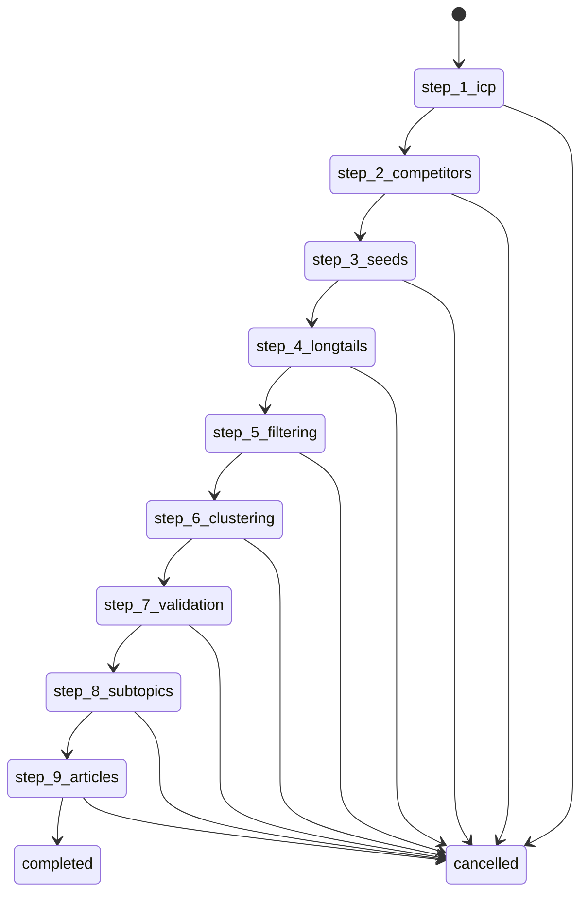

# Infin8Content Documentation Master Index

**Last Updated:** 2026-02-14  
**Version:** v2.0  
**Status:** Production-Ready Documentation

## 📚 Navigation Overview

This index serves as the central hub for all Infin8Content documentation. It provides organized access to architecture guides, API references, implementation details, and development resources.

---

## 🏗️ **Project Documentation**

### [Architecture Overview](./project-documentation/architecture/README.md)
System design, component architecture, and technology stack

### [API Reference](./project-documentation/api/README.md)
Complete API documentation with endpoints and examples

### [Database Schema](./project-documentation/database/README.md)
Database design, migrations, and data relationships

### [Workflow System](./project-documentation/workflows/workflow-system-documentation.md)
Complete workflow engine documentation

### [Deployment Guide](./project-documentation/deployment/README.md)
Production deployment and operations guide

---

## 🔍 **Source Analysis**

### [Intent Engine Analysis](./source-analysis/intent-engine-analysis.md)
- 23 specialized services
- 9-step workflow orchestration
- State machine implementation
- Service dependency mapping

### [Article Generation Analysis](./source-analysis/article-generation-analysis.md)
- 14 service pipeline
- OpenRouter integration
- Quality assurance system
- Performance optimization

### [API Structure Analysis](./source-analysis/api-structure-analysis.md)
- 48 endpoints across 10 domains
- Authentication patterns
- Error handling strategies
- Security implementation

### [Keyword Research Analysis](./source-analysis/keyword-research-analysis.md)
- DataForSEO integration
- Hub-and-spoke clustering
- Semantic analysis
- SEO intelligence pipeline

### [Dependencies Analysis](./source-analysis/dependencies-analysis.md)
- 35 production dependencies
- 40 development dependencies
- External service integrations
- Security and performance considerations

### [Code Patterns Analysis](./source-analysis/code-patterns-analysis.md)
- Service layer patterns
- API route conventions
- Error handling hierarchy
- Testing strategies

---

## 📋 **Quick Reference**

### **Getting Started**
- [Setup Guide](./docs/development-guide.md)
- [Environment Configuration](./docs/environment-setup.md)
- [Architecture Summary](./ARCHITECTURE_SUMMARY.md)

### **Core Features**
- **Intent Engine**: 9-step content workflow
- **Article Generation**: AI-powered content creation
- **Keyword Research**: SEO intelligence system
- **Workflow Management**: State machine orchestration

### **Development**
- [API Contracts](./docs/api-contracts.md)
- [Database Schema](./docs/DATABASE_SCHEMA.md)
- [Component Library](./docs/design-system/README.md)

### **Operations**
- [Production Checklist](./docs/production-validation-checklist.md)
- [Security Implementation](./docs/article-generation-security-implementation-complete.md)
- [Performance Monitoring](./docs/implementation-analysis-auth-usage-activity.md)

---

## 🎯 **System Architecture**

### **Technology Stack**
```
Frontend: Next.js 16 + React 19 + TypeScript
Backend: Supabase (PostgreSQL) + Inngest
AI Services: OpenRouter + DataForSEO + Tavily + Perplexity
Payments: Stripe
Monitoring: Sentry
```

### **Key Components**

#### **Intent Engine** (27 services)
- ICP Generation
- Competitor Analysis
- Keyword Expansion
- Topic Clustering
- Article Generation
- Workflow State Management
- Audit Logging
- Deterministic Testing

#### **Article Pipeline** (14 services)
- Outline Generation
- Section Processing
- Quality Assurance
- Citation Management
- Performance Monitoring

#### **API Layer** (48 endpoints)
- Authentication (5 endpoints)
- Workflows (11 endpoints)
- Articles (9 endpoints)
- Keywords (2 endpoints)
- Analytics (5 endpoints)
- Admin (8 endpoints)
- Debug (3 endpoints)
- Audit (1 endpoint)
- Inngest (1 endpoint)

#### **Database Schema**
- `intent_workflows` - Workflow state management
- `keywords` - SEO keyword hierarchy
- `articles` - Generated content
- `topic_clusters` - Semantic organization
- `intent_audit_logs` - Compliance trail
- `organizations` - Multi-tenant data

---

## 🔄 **Workflow States**



### **Step Details**

| Step | Purpose | Service | Output | Approval |
|------|---------|---------|--------|----------|
| 1 | Generate ICP | `icp-generator.ts` | ICP analysis | No |
| 2 | Analyze competitors | `competitor-seed-extractor.ts` | Seed keywords | No |
| 3 | Approve seeds | `seed-approval-processor.ts` | Approval records | Yes |
| 4 | Expand keywords | `longtail-keyword-expander.ts` | Long-tail keywords | No |
| 5 | Filter keywords | `keyword-filter.ts` | Filtered keywords | No |
| 6 | Cluster topics | `keyword-clusterer.ts` | Topic clusters | No |
| 7 | Validate clusters | `cluster-validator.ts` | Validation results | No |
| 8 | Generate subtopics | `subtopic-generator.ts` | Subtopic ideas | Yes |
| 9 | Generate articles | `article-queuing-processor.ts` | Articles | No |

---

## 🔐 **Security & Compliance**

### **Multi-Tenant Architecture**
- Organization-based data isolation
- Row Level Security (RLS) policies
- JWT authentication
- Role-based access control

### **Audit Trail**
- Complete workflow audit logging
- User action tracking
- IP address and user agent logging
- Immutable audit records

### **Data Protection**
- Input validation with Zod
- SQL injection prevention
- XSS protection
- CSRF protection
- Rate limiting

---

## 📊 **Performance Metrics**

### **System Performance**
- **State Transitions**: < 100ms
- **API Response Times**: < 500ms average
- **Article Generation**: 5-30 minutes
- **Concurrent Workflows**: 100+ simultaneous

### **Cost Efficiency**
- **ICP Generation**: ~$0.001-0.003
- **Article Generation**: ~$0.002 per article
- **Keyword Research**: ~$0.0027 per organization
- **Total per Workflow**: ~$0.01-0.05

### **Scalability**
- **Horizontal Scaling**: Stateless services
- **Database**: Connection pooling
- **Background Jobs**: Inngest processing
- **Caching**: In-memory and Redis

---

## 🧪 **Testing Strategy**

### **Test Coverage**
- **Unit Tests**: Service layer logic
- **Integration Tests**: API endpoints
- **E2E Tests**: Full user workflows
- **Performance Tests**: Load and stress testing

### **Test Framework**
- **Unit**: Vitest
- **E2E**: Playwright
- **Components**: Testing Library
- **Contracts**: Custom contract tests

### **Quality Gates**
- 90%+ code coverage required
- All tests must pass
- Security review for sensitive changes
- Performance benchmarks

---

## 🚀 **Deployment**

### **Environment Setup**
- **Development**: Local development with Docker
- **Staging**: Preview deployments
- **Production**: Vercel with edge functions

### **Infrastructure**
- **Database**: Supabase PostgreSQL
- **Background Jobs**: Inngest
- **File Storage**: Supabase Storage
- **Monitoring**: Sentry + custom metrics

### **CI/CD Pipeline**
- **Automated Testing**: On every PR
- **Security Scanning**: Dependency checks
- **Performance Testing**: Load testing
- **Deployment**: Automatic on merge

---

## 📈 **Monitoring & Observability**

### **Application Metrics**
- Workflow completion rates
- API response times
- Error rates by service
- Resource utilization

### **Business Metrics**
- Article generation volume
- User engagement
- Cost per workflow
- Quality scores

### **Health Checks**
- Database connectivity
- External service status
- Background job queue
- Performance thresholds

---

## 🔧 **Development Tools**

### **Local Development**
```bash
# Start development server
npm run dev

# Run tests
npm run test

# Type checking
npm run typecheck

# Linting
npm run lint
```

### **Database Management**
```bash
# Run migrations
supabase db push

# Reset database
supabase db reset

# Generate types
supabase gen types typescript
```

### **Testing Commands**
```bash
# Unit tests
npm run test:run

# Integration tests
npm run test:integration

# E2E tests
npm run test:e2e

# Contract tests
npm run test:contracts
```

---

## 📚 **Learning Resources**

### **For New Developers**
1. Read [Architecture Overview](./project-documentation/architecture/README.md)
2. Follow [Setup Guide](./docs/development-guide.md)
3. Study [Code Patterns](./source-analysis/code-patterns-analysis.md)
4. Review [API Documentation](./project-documentation/api/README.md)

### **For System Administrators**
1. Review [Deployment Guide](./project-documentation/deployment/README.md)
2. Study [Security Implementation](./docs/article-generation-security-implementation-complete.md)
3. Understand [Database Schema](./docs/DATABASE_SCHEMA.md)
4. Monitor [Performance Metrics](./docs/implementation-analysis-auth-usage-activity.md)

### **For Product Managers**
1. Understand [Workflow System](./project-documentation/workflows/workflow-system-documentation.md)
2. Review [Feature Capabilities](./docs/feature-overview.md)
3. Study [User Workflows](./docs/user-journey.md)
4. Analyze [Business Metrics](./docs/metrics-dashboard.md)

---

## 🆘 **Support & Troubleshooting**

### **Common Issues**
- [Authentication Problems](./docs/troubleshooting/auth-issues.md)
- [Database Connection Issues](./docs/troubleshooting/database-issues.md)
- [Performance Problems](./docs/troubleshooting/performance-issues.md)
- [External Service Failures](./docs/troubleshooting/service-failures.md)

### **Debugging Tools**
- [Debug Endpoints](./docs/debugging/endpoints.md)
- [Logging Guide](./docs/debugging/logging.md)
- [Performance Profiling](./docs/debugging/profiling.md)
- [Error Analysis](./docs/debugging/error-analysis.md)

### **Getting Help**
- Create issue in GitHub repository
- Join development Discord channel
- Schedule office hours call
- Review troubleshooting documentation

---

## 📝 **Documentation Maintenance**

### **Update Schedule**
- **Architecture**: Quarterly review
- **API Documentation**: With each release
- **Source Analysis**: Monthly updates
- **Deployment Guides**: As needed

### **Contributing**
- Documentation follows same PR process as code
- All changes require review
- Version control for documentation
- Automated link checking

### **Quality Standards**
- Clear, concise language
- Code examples for all concepts
- Diagrams for complex flows
- Cross-references between sections

---

## 📋 **Document Status**

| Document | Status | Last Updated | Maintainer |
|----------|--------|--------------|------------|
| Architecture Overview | ✅ Current | 2026-02-14 | System Team |
| API Reference | ✅ Current | 2026-02-14 | API Team |
| Database Schema | ✅ Current | 2026-02-14 | Data Team |
| Workflow System | ✅ Current | 2026-02-14 | Workflow Team |
| Source Analysis | ✅ Current | 2026-02-14 | Dev Team |
| Deployment Guide | ✅ Current | 2026-02-14 | Ops Team |

---

## 🔮 **Roadmap**

### **Recent Enhancements**
- Enhanced workflow analytics
- Advanced AI model integration
- Performance optimization
- Mobile app development
- Unified DataForSEO geo configuration (94 locations, 48 languages)
- Enterprise-grade competitor ingestion with URL normalization
- Deterministic workflow state engine with atomic transitions
- Comprehensive audit logging system

### **Q2 2026**
- Workflow marketplace
- Advanced reporting
- Multi-language support
- Enterprise features

### **Q3 2026**
- GraphQL API
- Microservices architecture
- Advanced caching
- Real-time collaboration

### **Q4 2026**
- AI workflow optimization
- Advanced personalization
- Integration marketplace
- Enterprise SSO

---

## 📞 **Contact Information**

### **Development Team**
- **Tech Lead**: [Contact Info]
- **API Team**: [Contact Info]
- **Frontend Team**: [Contact Info]
- **DevOps Team**: [Contact Info]

### **Product Team**
- **Product Manager**: [Contact Info]
- **Design Team**: [Contact Info]
- **QA Team**: [Contact Info]

### **Support**
- **Documentation Issues**: Create GitHub issue
- **Technical Questions**: Join Discord
- **Business Inquiries**: Contact product team
- **Security Issues**: Follow security policy

---

*This documentation is maintained by the Infin8Content development team and is continuously updated to reflect the current state of the system.*
