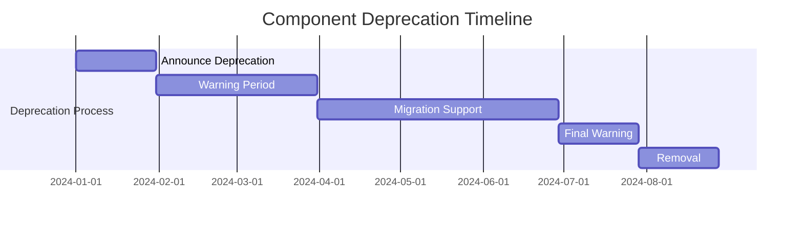

# Component Library Maintenance Procedures

## Overview

This document outlines the procedures for maintaining the Infin8Content component library, including regular maintenance tasks, version management, deprecation processes, and quality assurance.

## Maintenance Schedule

### 1. Daily Tasks
#### ✅ Daily Checklist
- [ ] **Monitor CI/CD pipeline** for build failures
- [ ] **Review new component submissions** in queue
- [ ] **Check compliance reports** for new violations
- [ ] **Address urgent bug reports** and issues
- [ ] **Update component documentation** as needed

#### 📋 Daily Procedures
```bash
# 1. Check CI/CD status
npm run ci:status

# 2. Review component queue
npm run components:queue

# 3. Check compliance
npm run compliance:check

# 4. Review urgent issues
npm run issues:urgent

# 5. Update documentation
npm run docs:update
```

### 2. Weekly Tasks
#### ✅ Weekly Checklist
- [ ] **Review component usage analytics** and trends
- [ ] **Update component dependencies** and packages
- [ ] **Run full test suite** including accessibility
- [ ] **Review performance benchmarks** and metrics
- [ ] **Update component documentation** with examples
- [ ] **Plan upcoming releases** and features

#### 📋 Weekly Procedures
```bash
# 1. Usage analytics
npm run analytics:usage

# 2. Update dependencies
npm run deps:update

# 3. Full test suite
npm run test:full

# 4. Performance benchmarks
npm run perf:benchmark

# 5. Documentation update
npm run docs:generate

# 6. Release planning
npm run release:plan
```

### 3. Monthly Tasks
#### ✅ Monthly Checklist
- [ ] **Comprehensive component audit** for quality
- [ ] **Update design tokens** and variables
- [ ] **Review and update guidelines** and standards
- [ ] **Conduct user feedback sessions** and surveys
- [ ] **Update component roadmap** and priorities
- [ ] **Performance optimization** and bundle analysis

#### 📋 Monthly Procedures
```bash
# 1. Component audit
npm run audit:components

# 2. Update design tokens
npm run tokens:update

# 3. Update guidelines
npm run guidelines:update

# 4. User feedback
npm run feedback:collect

# 5. Update roadmap
npm run roadmap:update

# 6. Performance optimization
npm run perf:optimize
```

### 4. Quarterly Tasks
#### ✅ Quarterly Checklist
- [ ] **Major version planning** and roadmap
- [ ] **Architecture review** and improvements
- [ ] **Security audit** and vulnerability assessment
- [ ] **Team training** and skill development
- [ ] **Tool and process evaluation**
- [ ] **Community feedback** and contribution review

#### 📋 Quarterly Procedures
```bash
# 1. Version planning
npm run version:plan

# 2. Architecture review
npm run arch:review

# 3. Security audit
npm run security:audit

# 4. Team training
npm run training:plan

# 5. Tool evaluation
npm run tools:evaluate

# 6. Community review
npm run community:review
```

## Version Management

### 1. Semantic Versioning
#### ✅ Version Guidelines
```json
{
  "version": "1.2.3"
  // MAJOR.MINOR.PATCH
  // MAJOR: Breaking changes, major redesigns
  // MINOR: New features, new components, backward compatible
  // PATCH: Bug fixes, documentation updates, performance improvements
}
```

#### 📋 Version Types
- **PATCH (0.0.X)**: 
  - Bug fixes
  - Documentation updates
  - Performance improvements
  - Security patches
  - Typo corrections

- **MINOR (0.X.0)**:
  - New components
  - New features
  - New variants
  - Enhanced functionality
  - Backward compatible changes

- **MAJOR (X.0.0)**:
  - Breaking changes
  - API changes
  - Major redesigns
  - Architecture changes
  - Deprecated features removal

### 2. Release Process
#### ✅ Release Checklist
- [ ] **All tests pass** in CI/CD
- [ ] **Documentation updated** for all changes
- [ ] **Changelog updated** with version notes
- [ ] **Performance benchmarks** met
- [ ] **Accessibility compliance** verified
- [ ] **Security scan** passed
- [ ] **Design system compliance** confirmed

#### 📋 Release Process
```bash
# 1. Prepare release
npm run release:prepare

# 2. Run full test suite
npm run test:full

# 3. Update documentation
npm run docs:update

# 4. Update changelog
npm run changelog:update

# 5. Build package
npm run build

# 6. Run security scan
npm run security:scan

# 7. Publish release
npm run release:publish

# 8. Post-release tasks
npm run release:post
```

### 3. Release Communication
#### ✅ Communication Template
```markdown
## Release v[Version] - [Date]

### 🎉 What's New
- New component: [Component Name]
- Enhanced feature: [Feature Description]
- Performance improvement: [Improvement Description]

### 🐛 Bug Fixes
- Fixed issue with [Component] not rendering correctly
- Resolved accessibility issue in [Component]
- Fixed performance regression in [Component]

### ⚠️ Breaking Changes
- [Component] API changed from old to new
- Deprecated prop removed from [Component]
- Design token renamed from old to new

### 📚 Documentation Updates
- Updated [Component] documentation
- Added new usage examples
- Improved API reference

### 🔄 Migration Guide
[Link to migration guide if breaking changes]

### 🙏 Contributors
- [@contributor1] - Component implementation
- [@contributor2] - Documentation updates
- [@contributor3] - Bug fixes

### 📦 Installation
```bash
npm install @infin8content/design-system@latest
```

### 🔗 Links
- [Documentation](https://design-system.infin8content.com)
- [Changelog](https://github.com/infin8content/design-system/blob/main/CHANGELOG.md)
- [Issues](https://github.com/infin8content/design-system/issues)
```

## Deprecation Process

### 1. Deprecation Timeline
#### ✅ Deprecation Schedule


#### 📋 Deprecation Phases
1. **Announcement (30 days)**: Communicate deprecation to team
2. **Warning Period (60 days)**: Add deprecation warnings
3. **Migration Support (90 days)**: Provide migration tools and docs
4. **Final Warning (30 days)**: Last warning before removal
5. **Removal (30 days)**: Remove deprecated code

### 2. Deprecation Implementation
#### ✅ Deprecation Code Pattern
```tsx
// ✅ Deprecation warning implementation
const DeprecatedComponent = ({ oldProp, newProp, ...props }) => {
  // Show deprecation warning in development
  if (process.env.NODE_ENV === 'development') {
    if (oldProp !== undefined) {
      console.warn(
        `DeprecatedComponent: 'oldProp' is deprecated and will be removed in v2.0.0. ` +
        `Use 'newProp' instead. See: https://design-system.infin8content.com/migration/v2.0.0`
      );
    }
  }

  // Migration logic
  const migratedProps = {
    newProp: newProp || oldProp,
    ...props
  };

  return <NewComponent {...migratedProps} />;
};

// ✅ Migration helper
const migrateComponentProps = (props, version) => {
  const migrations = {
    '1.0.0': {
      oldProp: 'newProp',
      anotherOld: 'anotherNew'
    }
  };

  const versionMigrations = migrations[version] || {};
  const migratedProps = { ...props };

  Object.entries(versionMigrations).forEach(([oldProp, newProp]) => {
    if (props[oldProp] !== undefined) {
      console.warn(
        `Prop '${oldProp}' is deprecated. Use '${newProp}' instead.`
      );
      migratedProps[newProp] = props[oldProp];
      delete migratedProps[oldProp];
    }
  });

  return migratedProps;
};
```

### 3. Migration Support
#### ✅ Migration Guide Template
```markdown
# Migration Guide: v[Old Version] → v[New Version]

## Overview
This guide helps you migrate from version [old] to [new] of the design system.

## Breaking Changes

### 1. Component Name Changes
- `OldComponent` → `NewComponent`
- `AnotherOld` → `AnotherNew`

### 2. Prop Changes
- `oldProp` → `newProp`
- `removedProp` → Removed (use alternative)

### 3. API Changes
- Method signature changed
- Event handler changes
- Callback changes

## Migration Steps

### Step 1: Update Imports
```tsx
// Before
import { OldComponent } from '@infin8content/design-system';

// After
import { NewComponent } from '@infin8content/design-system';
```

### Step 2: Update Props
```tsx
// Before
<OldComponent oldProp="value" />

// After
<NewComponent newProp="value" />
```

### Step 3: Update Event Handlers
```tsx
// Before
<OldComponent onOldEvent={handler} />

// After
<NewComponent onNewEvent={handler} />
```

## Automated Migration
```bash
# Run automated migration script
npm run migrate:v[version]
```

## Testing Your Migration
```bash
# Test migration
npm run test:migration

# Validate migration
npm run validate:migration
```

## Getting Help
- [Documentation](https://design-system.infin8content.com)
- [Support](mailto:support@infin8content.com)
- [Community Forum](https://community.infin8content.com)
```

## Quality Assurance

### 1. Automated Testing
#### ✅ Test Suite
```bash
# 1. Unit tests
npm run test:unit

# 2. Integration tests
npm run test:integration

# 3. Accessibility tests
npm run test:accessibility

# 4. Performance tests
npm run test:performance

# 5. Visual regression tests
npm run test:visual

# 6. Compliance tests
npm run test:compliance
```

#### ✅ Test Coverage Requirements
- **Unit Tests**: > 90% line coverage
- **Integration Tests**: All component interactions
- **Accessibility Tests**: WCAG 2.1 AA compliance
- **Performance Tests**: < 100ms render time
- **Visual Tests**: No visual regressions
- **Compliance Tests**: 100% design system compliance

### 2. Manual Testing
#### ✅ Manual Testing Checklist
- [ ] **Cross-browser testing** (Chrome, Firefox, Safari, Edge)
- [ ] **Mobile testing** (iOS, Android)
- [ ] **Screen reader testing** (NVDA, JAWS, VoiceOver)
- [ ] **Keyboard navigation testing**
- [ ] **Touch interaction testing**
- [ ] **High contrast mode testing**
- [ ] **Reduced motion testing**

### 3. Performance Monitoring
#### ✅ Performance Metrics
```typescript
interface PerformanceMetrics {
  renderTime: number;        // Component render time
  bundleSize: number;        // Component bundle size
  memoryUsage: number;       // Memory consumption
  reRenderCount: number;     // Unnecessary re-renders
  accessibilityScore: number; // Accessibility compliance
  complianceScore: number;    // Design system compliance
}

// Performance monitoring implementation
const performanceMonitor = {
  measureRenderTime: (component: string) => {
    // Measure component render time
  },
  
  measureBundleSize: (component: string) => {
    // Measure component bundle size
  },
  
  measureMemoryUsage: (component: string) => {
    // Measure memory consumption
  },
  
  generateReport: () => {
    // Generate performance report
  }
};
```

## Component Health Monitoring

### 1. Usage Analytics
#### ✅ Analytics Metrics
- **Component Usage**: How many times each component is used
- **Variant Usage**: Which variants are most popular
- **Error Rates**: Component error frequency
- **Performance Metrics**: Component performance data
- **User Feedback**: User satisfaction scores

#### 📋 Analytics Implementation
```typescript
interface ComponentAnalytics {
  componentId: string;
  usageCount: number;
  variantUsage: Record<string, number>;
  errorRate: number;
  performanceScore: number;
  userSatisfaction: number;
  lastUpdated: string;
}

// Analytics collection
const analyticsCollector = {
  trackUsage: (componentId: string, variant?: string) => {
    // Track component usage
  },
  
  trackError: (componentId: string, error: Error) => {
    // Track component errors
  },
  
  trackPerformance: (componentId: string, metrics: PerformanceMetrics) => {
    // Track performance metrics
  },
  
  generateReport: () => {
    // Generate analytics report
  }
};
```

### 2. Health Scoring
#### ✅ Health Score Calculation
```typescript
interface HealthScore {
  componentId: string;
  overallScore: number;
  categories: {
    codeQuality: number;
    performance: number;
    accessibility: number;
    compliance: number;
    usage: number;
  };
  issues: string[];
  recommendations: string[];
}

// Health scoring implementation
const healthScorer = {
  calculateScore: (componentId: string): HealthScore => {
    // Calculate overall health score
  },
  
  identifyIssues: (componentId: string): string[] => {
    // Identify health issues
  },
  
  generateRecommendations: (score: HealthScore): string[] => {
    // Generate improvement recommendations
  }
};
```

## Emergency Procedures

### 1. Critical Bug Response
#### ✅ Emergency Response Process
1. **Issue Identification**: Critical bug reported
2. **Impact Assessment**: Determine affected components and users
3. **Emergency Fix**: Develop and test hotfix
4. **Rapid Release**: Deploy emergency fix
5. **Communication**: Notify users of issue and fix
6. **Post-mortem**: Analyze root cause and prevention

#### 📋 Emergency Response Template
```markdown
## Emergency Bug Response: [Bug ID]

### 🚨 Issue Summary
- **Severity**: [CRITICAL/HIGH/MEDIUM/LOW]
- **Components Affected**: [List of components]
- **Users Affected**: [Number of users]
- **Impact**: [Description of impact]

### 🔧 Fix Details
- **Root Cause**: [Description of root cause]
- **Solution**: [Description of fix]
- **Testing**: [Testing performed]
- **Deployment**: [Deployment details]

### 📢 Communication
- **Internal Notification**: [Team notification sent]
- **User Notification**: [User communication sent]
- **Documentation**: [Documentation updated]

### 📊 Impact Assessment
- **Issues Resolved**: [Number of issues resolved]
- **Users Restored**: [Number of users restored]
- **Performance Impact**: [Performance impact assessment]

### 📋 Post-mortem
- **Lessons Learned**: [What we learned]
- **Prevention Measures**: [How to prevent future issues]
- **Process Improvements**: [Process improvements needed]
```

### 2. Security Incident Response
#### ✅ Security Response Process
1. **Incident Detection**: Security vulnerability identified
2. **Threat Assessment**: Evaluate risk and impact
3. **Immediate Action**: Apply security patches
4. **Investigation**: Analyze breach scope
5. **Communication**: Notify stakeholders
6. **Remediation**: Complete security fix
7. **Prevention**: Improve security measures

## Documentation Maintenance

### 1. Documentation Review
#### ✅ Documentation Checklist
- [ ] **Component documentation** accurate and complete
- [ ] **API reference** up to date
- [ ] **Usage examples** working and relevant
- [ ] **Migration guides** current and helpful
- [ ] **Changelog** updated with all changes
- [ ] **Guidelines** reflect current standards

### 2. Documentation Updates
#### ✅ Update Process
```bash
# 1. Update documentation
npm run docs:update

# 2. Validate documentation
npm run docs:validate

# 3. Generate documentation
npm run docs:generate

# 4. Deploy documentation
npm run docs:deploy
```

## Team Procedures

### 1. Team Meetings
#### ✅ Meeting Schedule
- **Daily Standup**: 15 minutes - Progress and blockers
- **Weekly Review**: 1 hour - Component review and planning
- **Monthly Planning**: 2 hours - Roadmap and strategy
- **Quarterly Retrospective**: 2 hours - Process improvement

### 2. Knowledge Sharing
#### ✅ Knowledge Sharing Activities
- **Code Reviews**: Peer learning and quality improvement
- **Design Reviews**: Design system consistency
- **Documentation**: Knowledge capture and sharing
- **Training**: Skill development and onboarding
- **Presentations**: Component showcases and best practices

## Resources

### 📚 Documentation
- [Component Guidelines](./component-guidelines.md)
- [Review Process](./review-process.md)
- [Accessibility Standards](./accessibility.md)
- [Testing Standards](../testing/)

### 🛠 Tools
- [Compliance Checker](../../tools/compliance-check.js)
- [Performance Monitor](../../tools/performance-monitor.js)
- [Analytics Collector](../../tools/analytics-collector.js)
- [Health Scorer](../../tools/health-scorer.js)

### 📞 Support
- Design System Team: design-system@company.com
- Emergency Response: emergency@company.com
- Security Issues: security@company.com

---

**Last Updated**: January 15, 2026  
**Version**: 1.0.0  
**Next Review**: March 15, 2026
