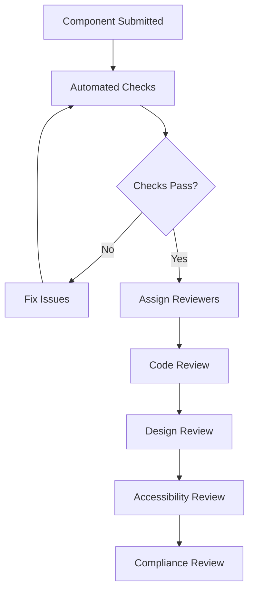

# Component Review Process

## Overview

The component review process ensures all components meet quality standards before being integrated into the design system. This process covers code review, design review, accessibility review, and compliance validation.

## Review Types

### 1. Code Review
Focuses on implementation quality, patterns, and technical standards.

#### 📋 Code Review Checklist
- [ ] **Design System Compliance**
  - No hard-coded colors (#hex values)
  - No arbitrary spacing (px values)
  - No custom font sizes
  - No inline styles
  - Semantic HTML elements used
  - Design tokens used correctly

- [ ] **Code Quality**
  - Single responsibility principle
  - Clear prop interfaces
  - Proper TypeScript types
  - Error handling implemented
  - Performance considerations
  - No anti-patterns

- [ ] **Testing**
  - Unit tests written
  - Accessibility tests pass
  - Edge cases covered
  - Test coverage > 90%
  - Integration tests if needed

- [ ] **Documentation**
  - JSDoc comments complete
  - Props documented
  - Usage examples provided
  - Storybook stories created
  - API reference updated

#### 🔍 Code Review Process
1. **Author submits PR** with component code
2. **Automated checks run** (linting, tests, compliance)
3. **Code reviewer assigned** from design system team
4. **Review conducted** using checklist above
5. **Feedback provided** with specific issues and suggestions
6. **Author addresses feedback**
7. **Re-review and approval**

#### 📝 Code Review Template
```markdown
## Code Review: [Component Name]

### ✅ Approved
- [ ] Design system compliance
- [ ] Code quality standards
- [ ] Testing requirements
- [ ] Documentation completeness

### 🔍 Issues Found
#### Design System Compliance
- [ ] Hard-coded colors found
- [ ] Inline styles detected
- [ ] Arbitrary spacing values

#### Code Quality
- [ ] Prop interface unclear
- [ ] Missing error handling
- [ ] Performance concerns

#### Testing
- [ ] Insufficient test coverage
- [ ] Missing accessibility tests
- [ ] Edge cases not covered

### 💡 Suggestions
1. Use design tokens for all styling
2. Add comprehensive error handling
3. Improve test coverage
4. Update documentation

### 📊 Overall Assessment
- **Status**: [APPROVED/NEEDS_CHANGES/REJECTED]
- **Priority**: [HIGH/MEDIUM/LOW]
- **Next Steps**: [Specific actions required]
```

### 2. Design Review
Focuses on visual design, user experience, and design system consistency.

#### 📋 Design Review Checklist
- [ ] **Visual Design**
  - Follows design system guidelines
  - Consistent with existing components
  - Proper visual hierarchy
  - Appropriate use of color and typography
  - Responsive design considerations

- [ ] **User Experience**
  - Intuitive interaction patterns
  - Clear feedback states
  - Proper affordances
  - Accessibility considerations
  - Error states handled

- [ ] **Design System Integration**
  - Reusable and flexible
  - Extensible for future needs
  - Consistent with brand guidelines
  - Proper component composition
  - Design token usage

#### 🔍 Design Review Process
1. **Designer creates component designs** in Figma
2. **Design review scheduled** with design system team
3. **Review conducted** using design system principles
4. **Feedback provided** on visual and UX aspects
5. **Revisions made** based on feedback
6. **Final approval** from design lead

#### 📝 Design Review Template
```markdown
## Design Review: [Component Name]

### ✅ Design System Compliance
- [ ] Visual consistency
- [ ] Design token usage
- [ ] Typography hierarchy
- [ ] Color application
- [ ] Spacing and layout

### ✅ User Experience
- [ ] Interaction patterns
- [ ] Feedback states
- [ ] Error handling
- [ ] Accessibility
- [ ] Responsive design

### 🔍 Design Issues
#### Visual Design
- [ ] Inconsistent with design system
- [ ] Color contrast issues
- [ ] Typography problems
- [ ] Layout concerns

#### User Experience
- [ ] Unclear interactions
- [ ] Missing feedback
- [ ] Accessibility issues
- [ ] Responsive problems

### 💡 Design Recommendations
1. Adjust color usage for better contrast
2. Improve interaction feedback
3. Enhance responsive behavior
4. Refine visual hierarchy

### 📊 Design Assessment
- **Status**: [APPROVED/NEEDS_REVISIONS/REJECTED]
- **Priority**: [HIGH/MEDIUM/LOW]
- **Next Steps**: [Specific design actions]
```

### 3. Accessibility Review
Focuses on WCAG compliance, keyboard navigation, and screen reader support.

#### 📋 Accessibility Review Checklist
- [ ] **Semantic HTML**
  - Proper HTML elements used
  - Heading structure correct
  - Landmarks implemented
  - Lists and tables structured properly

- [ ] **ARIA Attributes**
  - ARIA labels present where needed
  - ARIA descriptions provided
  - Roles assigned correctly
  - States and properties accurate

- [ ] **Keyboard Navigation**
  - All interactive elements keyboard accessible
  - Tab order logical
  - Focus indicators visible
  - Keyboard shortcuts documented

- [ ] **Screen Reader Support**
  - Content announced properly
  - Alternative text provided
  - Form labels associated
  - Dynamic content announced

- [ ] **Visual Accessibility**
  - Color contrast meets WCAG AA
  - Text resizable
  - No reliance on color alone
  - Motion considerations

#### 🔍 Accessibility Review Process
1. **Automated accessibility tests** run (axe-core)
2. **Manual accessibility review** conducted
3. **Screen reader testing** performed
4. **Keyboard navigation testing** completed
5. **Color contrast validation** checked
6. **Accessibility report** generated
7. **Issues addressed** and re-tested

#### 📝 Accessibility Review Template
```markdown
## Accessibility Review: [Component Name]

### ✅ WCAG Compliance
- [ ] Semantic HTML
- [ ] ARIA attributes
- [ ] Keyboard navigation
- [ ] Screen reader support
- [ ] Color contrast
- [ ] Text resizing

### 🔍 Accessibility Issues
#### Semantic HTML
- [ ] Improper heading structure
- [ ] Missing landmarks
- [ ] Incorrect list markup

#### ARIA Attributes
- [ ] Missing ARIA labels
- [ ] Incorrect roles
- [ ] Missing descriptions

#### Keyboard Navigation
- [ ] Elements not keyboard accessible
- [ ] Poor tab order
- [ ] Missing focus indicators

#### Screen Reader Support
- [ ] Content not announced
- [ ] Missing alternative text
- [ ] Form issues

### 💡 Accessibility Recommendations
1. Add proper ARIA labels
2. Improve keyboard navigation
3. Enhance screen reader support
4. Fix color contrast issues

### 📊 Accessibility Assessment
- **WCAG Level**: [A/AA/AAA]
- **Status**: [COMPLIANT/NEEDS_FIXES/NON_COMPLIANT]
- **Priority**: [HIGH/MEDIUM/LOW]
- **Next Steps**: [Specific accessibility actions]
```

### 4. Compliance Review
Focuses on design system compliance and automated validation.

#### 📋 Compliance Review Checklist
- [ ] **Design Token Usage**
  - No hard-coded colors
  - No arbitrary spacing
  - No custom font sizes
  - Proper token usage

- [ ] **Code Standards**
  - No inline styles
  - Semantic HTML
  - Proper TypeScript
  - ESLint compliance

- [ ] **Testing Standards**
  - Unit tests pass
  - Accessibility tests pass
  - Coverage requirements met
  - Integration tests if needed

#### 🔍 Compliance Review Process
1. **Automated compliance checks** run
2. **Manual compliance review** conducted
3. **Design token validation** performed
4. **Code standards verification** completed
5. **Testing validation** checked
6. **Compliance report** generated
7. **Issues addressed** and re-validated

#### 📝 Compliance Review Template
```markdown
## Compliance Review: [Component Name]

### ✅ Design System Compliance
- [ ] Design token usage
- [ ] No hard-coded values
- [ ] Semantic HTML
- [ ] Code standards
- [ ] Testing standards

### 🔍 Compliance Issues
#### Design Tokens
- [ ] Hard-coded colors found
- [ ] Arbitrary spacing detected
- [ ] Custom font sizes

#### Code Standards
- [ ] Inline styles present
- [ ] ESLint violations
- [ ] TypeScript issues

#### Testing Standards
- [ ] Insufficient test coverage
- [ ] Missing accessibility tests
- [ ] Test failures

### 💡 Compliance Recommendations
1. Replace hard-coded values with tokens
2. Remove inline styles
3. Fix ESLint violations
4. Improve test coverage

### 📊 Compliance Assessment
- **Compliance Score**: [0-100%]
- **Status**: [COMPLIANT/NEEDS_FIXES/NON_COMPLIANT]
- **Priority**: [HIGH/MEDIUM/LOW]
- **Next Steps**: [Specific compliance actions]
```

## Review Workflow

### 1. Initial Review


### 2. Review Assignment
- **Code Reviewer**: Design system team member
- **Design Reviewer**: Design system designer
- **Accessibility Reviewer**: Accessibility specialist
- **Compliance Reviewer**: Design system lead

### 3. Review Timeline
- **Initial Review**: 2 business days
- **Author Response**: 3 business days
- **Re-review**: 1 business day
- **Final Approval**: 1 business day

### 4. Review Communication
- **PR Comments**: Specific feedback and suggestions
- **Review Meetings**: Complex discussions and decisions
- **Status Updates**: Regular progress communication
- **Final Sign-off**: Official approval documentation

## Review Templates

### 1. Pull Request Template
```markdown
## Component: [Component Name]

### Description
Brief description of the component and its purpose.

### Type
- [ ] New component
- [ ] Component update
- [ ] Bug fix
- [ ] Documentation update

### Changes Made
- What was changed
- Why it was changed
- Impact on existing components

### Testing
- [ ] Unit tests written
- [ ] Accessibility tests pass
- [ ] Manual testing completed
- [ ] Cross-browser testing

### Documentation
- [ ] Component documentation updated
- [ ] Storybook stories created
- [ ] API reference updated
- [ ] Usage examples provided

### Breaking Changes
- [ ] No breaking changes
- [ ] Breaking changes documented
- [ ] Migration guide provided

### Reviewers
- Code Review: @reviewer1
- Design Review: @reviewer2
- Accessibility Review: @reviewer3
- Compliance Review: @reviewer4

### Checklist
- [ ] Design system compliance
- [ ] Code quality standards
- [ ] Testing requirements
- [ ] Documentation complete
- [ ] Accessibility compliance
- [ ] Performance considerations
```

### 2. Review Summary Template
```markdown
## Review Summary: [Component Name]

### Overall Status: [APPROVED/NEEDS_CHANGES/REJECTED]

### Review Results
- **Code Review**: [APPROVED/NEEDS_CHANGES/REJECTED]
- **Design Review**: [APPROVED/NEEDS_CHANGES/REJECTED]
- **Accessibility Review**: [COMPLIANT/NEEDS_FIXES/NON_COMPLIANT]
- **Compliance Review**: [COMPLIANT/NEEDS_FIXES/NON_COMPLIANT]

### Issues Summary
#### High Priority
- Issue 1: Description
- Issue 2: Description

#### Medium Priority
- Issue 3: Description
- Issue 4: Description

#### Low Priority
- Issue 5: Description

### Required Actions
1. Fix high-priority issues
2. Update documentation
3. Add missing tests
4. Address accessibility concerns

### Next Steps
- [ ] Address feedback
- [ ] Re-run tests
- [ ] Schedule re-review
- [ ] Merge to main

### Reviewers
- Code: @reviewer1
- Design: @reviewer2
- Accessibility: @reviewer3
- Compliance: @reviewer4
```

## Quality Gates

### 1. Automated Gates
- [ ] All tests pass
- [ ] ESLint compliance
- [ ] Design system compliance
- [ ] Accessibility compliance
- [ ] Build success

### 2. Manual Gates
- [ ] Code review approved
- [ ] Design review approved
- [ ] Accessibility review approved
- [ ] Compliance review approved
- [ ] Documentation complete

### 3. Release Gates
- [ ] All reviews approved
- [ ] Quality gates passed
- [ ] Performance benchmarks met
- [ ] Security review passed
- [ ] Release notes prepared

## Review Metrics

### 1. Review Performance
- **Review Time**: Average time per review
- **Approval Rate**: Percentage of components approved
- **Revision Rate**: Average revisions per component
- **Quality Score**: Post-review quality metrics

### 2. Component Quality
- **Compliance Score**: Design system compliance percentage
- **Accessibility Score**: WCAG compliance level
- **Test Coverage**: Percentage of code covered
- **Documentation Score**: Documentation completeness

### 3. Team Performance
- **Review Capacity**: Reviews completed per week
- **Backlog Size**: Components awaiting review
- **Review Distribution**: Workload across reviewers
- **Satisfaction Score**: Team satisfaction with process

## Resources

### 📚 Documentation
- [Component Guidelines](./component-guidelines.md)
- [Design Tokens](../tokens/)
- [Accessibility Standards](./accessibility.md)
- [Testing Standards](../testing/)

### 🛠 Tools
- [Compliance Checker](../../tools/compliance-check.js)
- [ESLint Configuration](../../.eslintrc.design-system.js)
- [Accessibility Testing](../../tools/accessibility-test.js)
- [Performance Testing](../../tools/performance-test.js)

### 📞 Support
- Design System Team: design-system@company.com
- Code Review: code-review@company.com
- Design Review: design-review@company.com
- Accessibility Review: a11y-review@company.com

---

**Last Updated**: January 15, 2026  
**Version**: 1.0.0  
**Next Review**: March 15, 2026
