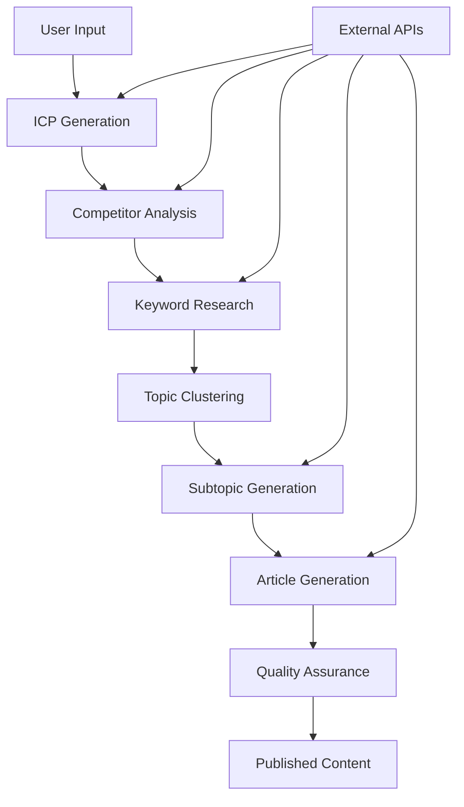

# Architecture Overview

## System Architecture

Infin8Content is built on a modern, scalable architecture designed for enterprise-grade content creation workflows.

## Technology Stack

### Frontend
- **Next.js 16**: React framework with App Router
- **React 19**: UI library with latest features
- **TypeScript**: Type safety and development experience
- **Tailwind CSS**: Utility-first styling
- **Radix UI**: Accessible component primitives

### Backend
- **Supabase**: PostgreSQL database with real-time features
- **Inngest**: Background job processing
- **Next.js API Routes**: Serverless API endpoints
- **PostgreSQL**: Primary database with RLS

### AI & External Services
- **OpenRouter**: LLM model access and routing
- **DataForSEO**: SEO intelligence and keyword data
- **Tavily**: Real-time web research
- **Perplexity**: Advanced research and planning
- **Stripe**: Payment processing

### Infrastructure
- **Vercel**: Hosting and edge functions
- **Sentry**: Error tracking and monitoring
- **GitHub Actions**: CI/CD pipeline

## Core Components

### Intent Engine
The heart of the system, managing 9-step content creation workflows:
- ICP Generation
- Competitor Analysis
- Keyword Research
- Topic Clustering
- Article Generation

### Article Pipeline
Sophisticated content generation with quality assurance:
- Outline generation
- Section processing
- Citation management
- Quality validation

### Workflow State Machine
Deterministic state management with atomic transitions:
- Single source of truth
- Concurrent execution safety
- Comprehensive audit trail

## Data Flow

## Security Architecture

### Multi-Tenant Design
- Organization-based data isolation
- Row Level Security (RLS) policies
- JWT authentication
- Role-based access control

### Audit Trail
- Complete workflow audit logging
- User action tracking
- IP address and user agent logging
- Immutable audit records

## Performance Architecture

### Scalability Features
- Stateless service design
- Database connection pooling
- Background job processing
- Caching strategies

### Optimization
- Indexed database queries
- Batch processing
- Parallel execution
- Resource monitoring

## Deployment Architecture

### Environment Structure
- **Development**: Local development environment
- **Staging**: Preview deployments for testing
- **Production**: Live production environment

### Infrastructure Components
- **Application**: Vercel edge functions
- **Database**: Supabase PostgreSQL
- **Background Jobs**: Inngest processing
- **Monitoring**: Sentry error tracking

## Integration Architecture

### API Design
- RESTful API patterns
- Consistent authentication
- Standardized error handling
- Comprehensive documentation

### External Integrations
- AI service providers
- Payment processors
- Email services
- Analytics platforms

## Development Architecture

### Code Organization
- Service layer pattern
- Component-based UI
- Type-safe development
- Comprehensive testing

### Quality Assurance
- Unit and integration tests
- E2E testing with Playwright
- Code quality checks
- Security scanning

## Monitoring Architecture

### Application Monitoring
- Performance metrics
- Error tracking
- User behavior analytics
- System health checks

### Business Intelligence
- Workflow completion rates
- Content quality metrics
- Cost analysis
- User engagement data

## Future Architecture Plans

### Scalability Enhancements
- Microservices migration
- Event-driven architecture
- Advanced caching
- Horizontal scaling

### Feature Expansion
- GraphQL API
- Workflow marketplace
- Advanced AI features
- Enterprise integrations
