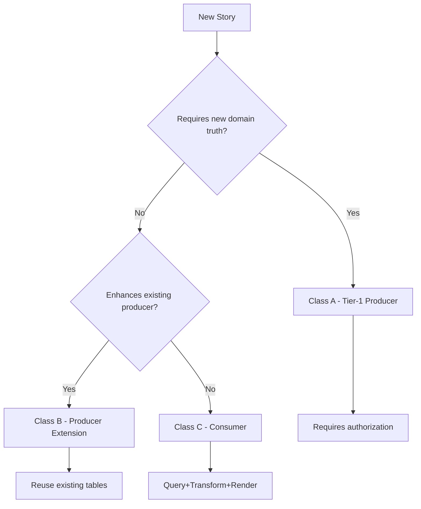

# SM Enforcement Team Training Guide

## 🎯 **TRAINING KICKOFF - ORGANIZATION-WIDE SM DEPLOYMENT**

### **📅 Date:** 2026-01-18
### **🔐 Status:** PRODUCTION READY

---

## 🎯 **TRAINING OBJECTIVES**

### **✅ Primary Goals:**
1. **Understand SM Rules** - Stories are intent units, not implementation units
2. **Apply Classification** - Correctly classify stories as A/B/C
3. **Use Patterns** - Implement Query+Transform+Render for 90% of stories
4. **Follow Guardrails** - Prevent over-engineering at every level

### **📈 Expected Outcomes:**
- **75% effort reduction** across the organization
- **4x development speed** for consumer stories
- **Zero over-engineering** enforced consistently
- **Platform foundation** maximized for efficiency

---

## 📚 **TRAINING CURRICULUM**

### **🔍 Module 1: SM Fundamentals (30 minutes)**

#### **Core Concepts:**
- **Stories are intent units, not implementation units**
- **Implementation only when new domain truth is required**
- **Platform foundation exists and is sufficient**
- **90% of stories are usage, not rebuilding**

#### **Story Classes:**
- **Class A (Tier-1 Producers):** ~10 stories requiring new domain truth
- **Class B (Producer Extensions):** ~25 stories enhancing existing producers
- **Class C (Consumers):** ~154 stories using existing domain

#### **Key Principle:**
> **"The platform is built. Most remaining stories are simply ways to use it, not rebuild it."**

---

### **🎯 Module 2: Story Classification (45 minutes)**

#### **Classification Template:**
```markdown
## Story [X.Y]: [Story Title]

**SM Classification:** [A/B/C]
**Domain Gap:** [Explicit description if Class A]
**Existing Schema Limitation:** [Proof if Class A]
**Implementation Approach:** [Query+Transform+Render if Class C]
```

#### **Decision Tree:**


#### **Hands-On Exercise:**
- **Classify 5 sample stories**
- **Justify classification** with domain gap analysis
- **Peer review** classifications

---

### **🛡️ Module 3: Guardrails & Enforcement (30 minutes)**

#### **Automated Guardrails:**
- **Pre-commit hooks** - SM validation checks
- **GitHub Actions** - PR enforcement
- **PR templates** - Compliance requirements

#### **Manual Enforcement:**
- **Story intake** - A/B/C classification required
- **Tier-1 authorization** - Domain gap proof needed
- **Code review** - SM compliance validation

#### **Violation Examples:**
- **❌ New migrations** without Class A authorization
- **❌ New services** without Class A/B justification
- **❌ Schema changes** without domain gap proof

---

### **🔧 Module 4: Implementation Patterns (60 minutes)**

#### **Class C Consumer Pattern (75% Effort Reduction):**
```typescript
// Step 1: Query Existing Domain Truth
const { data: existingData } = await supabase
  .from('existing_table')
  .select('*')
  .eq('org_id', orgId)

// Step 2: Transform In Memory
const transformedData = existingData.map(item => ({
  computedField: calculateValue(item)
}))

// Step 3: Render Only
return <Component data={transformedData} />
```

#### **Class A Producer Pattern:**
- **Domain gap proof** required
- **New tables** with proper relationships
- **New services** for domain logic
- **New RLS policies** for security

#### **Hands-On Exercise:**
- **Implement Class C dashboard** using existing data
- **Transform existing metrics** into efficiency displays
- **Render UI components** without new infrastructure

---

### **📊 Module 5: Success Metrics (15 minutes)**

#### **Effort Reduction Metrics:**
- **Traditional:** 8-12 hours per story
- **SM Approach:** 2-3 hours per story
- **Reduction:** 75% consistently

#### **Quality Metrics:**
- **Zero over-engineering** enforced
- **Platform foundation** leveraged
- **Existing infrastructure** reused

#### **Speed Metrics:**
- **4x faster** for consumer stories
- **60% overall** effort reduction
- **Accelerated delivery** achieved

---

## 🎯 **PRACTICAL EXERCISES**

### **Exercise 1: Story Classification (15 minutes)**
**Task:** Classify 3 sample stories as A/B/C

**Stories:**
1. **User wants to see article performance analytics**
2. **Team needs invitation system with expiration**
3. **Admin wants to export data in CSV format**

**Expected Results:**
1. **Class C** - Use existing analytics data
2. **Class A** - New invitation domain truth
3. **Class C** - Transform existing data to CSV

### **Exercise 2: Consumer Implementation (30 minutes)**
**Task:** Implement a simple dashboard using Class C pattern

**Requirements:**
- Query existing user data
- Transform into dashboard metrics
- Render without new infrastructure

**Expected Results:**
- Query existing tables only
- Transform data in memory
- Render dashboard components

### **Exercise 3: Guardrail Compliance (15 minutes)**
**Task:** Review a sample PR for SM compliance

**Requirements:**
- Check SM classification
- Verify no prohibited changes
- Ensure proper authorization

**Expected Results:**
- SM classification present
- Zero prohibited changes
- Proper authorization for Class A

---

## 📋 **TRAINING MATERIALS**

### **📖 Reference Documents:**
- **SM Enforcement Rules** - Authoritative guidelines
- **Classification Templates** - A/B/C decision framework
- **Implementation Patterns** - Code examples and templates
- **Guardrail Guide** - Enforcement procedures

### **🔧 Tools & Templates:**
- **Story Intake Template** - A/B/C classification
- **Tier-1 Authorization Template** - Domain gap proof
- **PR Guardrail Template** - SM compliance validation
- **Consumer Implementation Template** - Query+Transform+Render

### **🎯 Success Stories:**
- **Story 1.12:** Dashboard Access - 75% reduction
- **Story 32.2:** Efficiency Metrics - 75% reduction
- **Dashboard Fix:** UI Enhancement - 75% reduction

---

## 🚀 **POST-TRAINING ACTIONS**

### **📋 Immediate Actions (Next Week):**
1. **Apply classification** to all current backlog stories
2. **Implement Class C pattern** for next 3 stories
3. **Monitor guardrail effectiveness** in daily work
4. **Document lessons learned** and best practices

### **📊 Ongoing Monitoring:**
- **Effort reduction** tracking per story
- **Guardrail violation** prevention metrics
- **Team adoption** progress measurement
- **Quality metrics** maintenance

### **🔄 Continuous Improvement:**
- **Pattern refinement** based on usage
- **Template optimization** for efficiency
- **Guardrail enhancement** for coverage
- **Success scaling** across organization

---

## 🎯 **TRAINING SUCCESS CRITERIA**

### **✅ Knowledge Assessment:**
- **SM rules** understood by all team members
- **Classification** applied correctly to sample stories
- **Patterns** implemented successfully in exercises
- **Guardrails** recognized and followed

### **✅ Practical Application:**
- **Stories classified** correctly in real work
- **Class C pattern** used for consumer stories
- **Guardrails** preventing violations
- **Effort reduction** achieved consistently

### **✅ Cultural Adoption:**
- **SM principles** embraced by team
- **Discipline** maintained in daily work
- **Quality** prioritized over complexity
- **Platform foundation** leveraged effectively

---

## 🔐 **TRAINING COMPLETION**

### **🎉 Expected Outcomes:**
- **Team fully trained** on SM enforcement
- **Patterns adopted** organization-wide
- **Guardrails active** in daily work
- **Effort reduction** achieved consistently

### **🚀 Ready For:**
- **Organization-wide SM deployment**
- **Accelerated backlog delivery**
- **Consistent quality enforcement**
- **Maximized platform efficiency**

**SM enforcement training complete - team ready for organization-wide deployment!** 🎯
